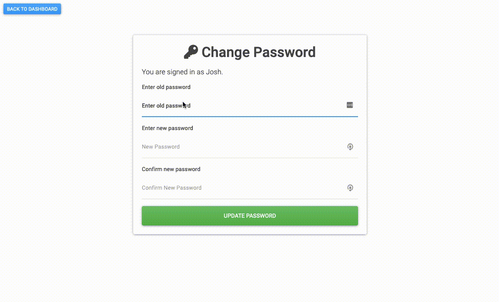

## Full CRUD app [Node/Express/EJS/MongoDB]

[see the code on github](https://github.com/JoshuaAdrianJones/node-auth)

## Landing Page [html/css]

[see the code on github](https://github.com/JoshuaAdrianJones/freecodecamp-product-landing-page)

## Documentation Page [html/css]

[see the code on github](https://github.com/JoshuaAdrianJones/freecodecamp-documentation)

## Survey Form [html/css]

[see the code on github](https://github.com/JoshuaAdrianJones/freecodecamp-survey-form)

## Expenses Calculator [html/css/js]

[see the code on github](https://github.com/JoshuaAdrianJones/expenses-tracker)
